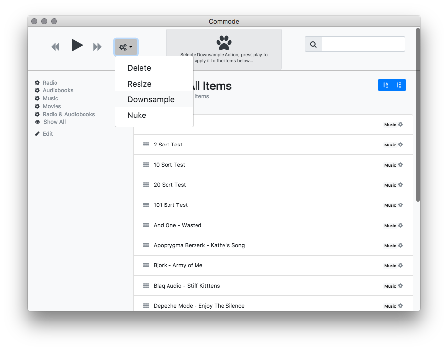

# commode
Electron-Vue based, iTunes like UI, for file tagging, restructuring, processing, and general management.





## Theory of Operation

- iTunes like view of your data
- You must prepare a directory with data.js, sort.js and filter.js
- .js before .json, program will seek a .js data file that may load json.
- You must create data.js/on based on your own data set.

## Action Handler Example (work.js)

When you hit play Promise's resolve, reject is sent to an emitter handler,
simply perform your operation and call resolve();

```JavaScript

emitter.on('example', function({app, item, name, resolve, reject }) {

  // make an indication that you are working on this item
  app.selectItem(item);

  // in this example we uppercase the name of the item...
  item.name = item.name.toUpperCase();

  setTimeout(function(){
    console.log( 'Working on %s.', name );
    // When the thing is done, call resolve...
    resolve();
  },200);


});

```

## Todo

- More samples
- drop built-in filter editor (just edit filter.js)
- maybe drop manual item editor in favor of actions?
