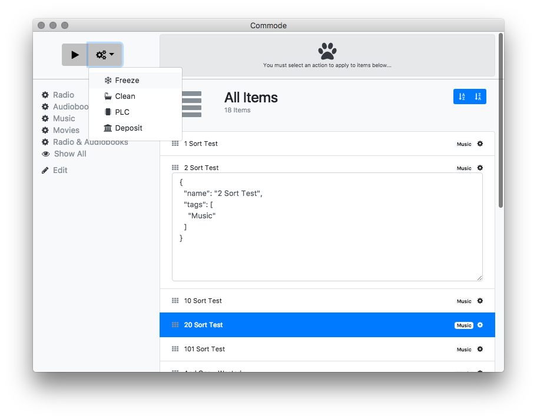

# commode
Electron-Vue based, iTunes like UI, for file tagging, restructuring, processing, and general management.

## Theory of Operation

- You must prepare a directory with data.js, sort.js and filter.js
- .js before .json, program will seek a .js data file that may load json.
- You must create data.js/on based on your own data set.

## What you get

- iTunes like view of your data
-
